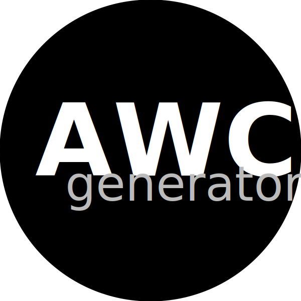

<h1 align="center">
    
    <br/>
    ReactJS | Next.js
</h1>

## About

Anime Watching Club Generator is a front-end application that generates challenge codes automatically from your Anilist anime username and URL.

Disclaimer: This app is completely unrelated with AWC or Anilist.

## Getting Started

1. Clone repository

```bash
 git clone https://github.com/carmachado/awc-generator.git
```

2. Run the development server:

```bash
npm run dev
# or
yarn dev
```

3. Open [http://localhost:3000](http://localhost:3000) with your browser to see the result.
